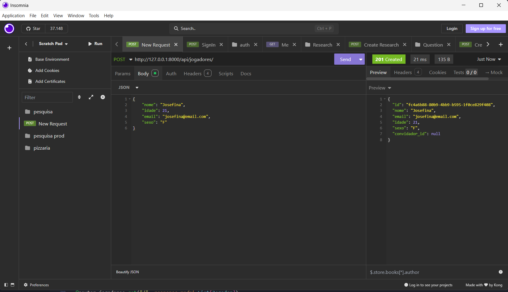

# Documentação API Galera do Volei

## Jogadores

- Nome
- Email
- Idade
- Sexo

### `GET` (api/jogadores)

- Retorna todos os jogadores cadastrados.


**Response**  
Status Code: `200`

```json
[
  {
    "id": 1,
    "nome": "",
    "email": "",
    "idade": 0,
    "sexo": ""
  }
]
```

### `GET` (api/jogadores/{id})

- Retorna os dados de um jogador específico.


**Response**  
Status Code: `200`

```json
{
  "id": "id",
  "nome": "",
  "email": "",
  "idade": 0,
  "sexo": ""
}
```

### `POST` (api/jogadores)

- Cadastra um novo jogador.



**Request**

```json
{
  "nome": "",
  "email": "",
  "idade": 0,
  "sexo": ""
}
```

**Response**  
Status Code: `201`

```json
{
  "id": 1,
  "nome": "",
  "email": "",
  "idade": 0,
  "sexo": ""
}
```

### `POST` (api/jogadores/convite/{codigo_convite})

- Cadastra um novo jogador utilizando um código de convite válido.


**Request**

```json
{
  "nome": "",
  "email": "",
  "idade": 0,
  "sexo": ""
}
```

**Response**  
Status Code: `201`

```json
{
  "id": "string",
  "nome": "",
  "email": "",
  "idade": 0,
  "sexo": "",
  "convidador_id": "string"
}
```

### `PUT` (api/jogadores/{id})

- Atualiza os dados de um jogador existente.


**Request**

```json
{
  "nome": "",
  "email": "",
  "idade": 0,
  "sexo": ""
}
```

**Response**  
Status Code: `200`

```json
{
  "id": "id",
  "nome": "",
  "email": "",
  "idade": 0,
  "sexo": ""
}
```

### `DELETE` (api/jogadores/{id})

- Remove um jogador do sistema.


**Response**  
Status Code: `204 No Content`

---

## Times

- Nome
- Categoria

### `GET` (api/times)

- Retorna todos os times cadastrados.


**Response**  
Status Code: `200`

```json
[
  {
    "id": 1,
    "nome": "",
    "categoria": ""
  }
]
```

### `GET` (api/times/{id})

- Retorna os dados de um time específico.


**Response**  
Status Code: `200`

```json
{
  "id": "id",
  "nome": "",
  "categoria": ""
}
```

### `POST` (api/times)

- Cadastra um novo time.


**Request**

```json
{
  "nome": "",
  "categoria": ""
}
```

**Response**  
Status Code: `201`

```json
{
  "id": 1,
  "nome": "",
  "categoria": ""
}
```

### `PUT` (api/times/{id})

- Atualiza os dados de um time existente.


**Request**

```json
{
  "nome": "",
  "categoria": ""
}
```

**Response**  
Status Code: `200`

```json
{
  "id": "id",
  "nome": "",
  "categoria": ""
}
```

### `DELETE` (api/times/{id})

- Remove um time do sistema.


**Response**  
Status Code: `204 No Content`

### `GET` (api/times/{id}/jogadores)

- Retorna todos os jogadores associados a um time específico.


**Response**  
Status Code: `200`

```json
[
  {
    "id": null,
    "nome": "",
    "email": "",
    "idade": 0,
    "sexo": ""
  },
  {
    "id": null,
    "nome": "",
    "email": "",
    "idade": 0,
    "sexo": ""
  }
]
```

### `GET` (api/times/{id}/partidas)

- Retorna todas as partidas em que um time específico participou.


**Response**  
Status Code: `200`

```json
[
  {
    "id": "id",
    "timeAnfitriao": "",
    "timeConvidado": "",
    "categoria": "",
    "data": "",
    "local": "",
    "status": ""
  }
]
```

---

## Partidas

- Time anfitrião
- Time convidado
- Categoria
- Data
- Local
- Status

### `GET` (api/partidas)

- Retorna todas as partidas cadastradas.

**Response**
Status Code: `200`

```json
[
  {
    "id": 1,
    "timeAnfitriao": "",
    "timeConvidado": "",
    "categoria": "",
    "data": "",
    "local": "",
    "status": ""
  }
]
```

### `GET` (api/partidas/{id})

- Retorna os dados de uma partida específica.

**Response**  
Status Code: `200`

```json
{
  "id": "id",
  "timeAnfitriao": "",
  "timeConvidado": "",
  "categoria": "",
  "data": "",
  "local": "",
  "status": ""
}
```

### `POST` (api/partidas)

- Agenda uma nova partida.

**Request**

```json
{
  "timeAnfitriao": "",
  "timeConvidado": "",
  "categoria": "",
  "data": "",
  "local": "",
  "status": ""
}
```

**Response**  
Status Code: `201`

```json
{
  "id": 1,
  "timeAnfitriao": "",
  "timeConvidado": "",
  "categoria": "",
  "data": "",
  "local": "",
  "status": ""
}
```

### `PUT` (api/partidas/{id})

- Atualiza os dados de uma partida existente.

**Request**

```json
{
  "timeAnfitriao": "",
  "timeConvidado": "",
  "categoria": "",
  "data": "",
  "local": "",
  "status": ""
}
```

**Response**  
Status Code: `200`

```json
{
  "id": "id",
  "timeAnfitriao": "",
  "timeConvidado": "",
  "categoria": "",
  "data": "",
  "local": "",
  "status": ""
}
```

### `DELETE` (api/partidas/{id})

- Remove uma partida do sistema.

**Response**  
Status Code: `204 No Content`

### `GET` (api/partidas/{id}/times)

- Retorna os times que participaram da partida especificada.

**Response**  
Status Code: `200`

```json
[
  {
    "id": null,
    "nome": "",
    "categoria": ""
  },
  {
    "id": null,
    "nome": "",
    "categoria": ""
  }
]
```

### `GET` (api/partidas/{id}/jogadores)

- Retorna os jogadores que participaram da partida especificada.

**Response**  
Status Code: `200`

```json
[
  {
    "id": null,
    "nome": "",
    "email": "",
    "idade": 0,
    "sexo": ""
  },
  {
    "id": null,
    "nome": "",
    "email": "",
    "idade": 0,
    "sexo": ""
  }
]
```

### `POST` (api/partidas/{id}/iniciar)

- Inicia uma partida específica, alterando seu status para "Em Andamento".

**Response**
Status Code: `200`

```json
{
  "id": "id",
  "timeAnfitriao": "",
  "timeConvidado": "",
  "categoria": "",
  "data": "",
  "local": "",
  "status": "Em Andamento"
}
```

### `POST` (api/partidas/{id}/finalizar)

- Finaliza uma partida específica, alterando seu status para "Encerrada".

**Response**
Status Code: `200`

```json
{
  "id": "id",
  "timeAnfitriao": "",
  "timeConvidado": "",
  "categoria": "",
  "data": "",
  "local": "",
  "status": "Encerrada"
}
```

## Convites

- Código do convite
- Convidador
- Usado

### `POST` (api/convites)

- Cria um novo convite para um jogador.

**Request**

```json
{
  "convidador_id": "string"
}
```

**Response**  
Status Code: `201`

```json
{
  "codigo": "string",
  "convidador_id": "string",
  "usado": false
}
```

### `GET` (api/convites/{codigo})

Consulta um convite pelo código.

**Response**  
Status Code: `200`

```json
{
  "codigo": "string",
  "convidador_id": "string",
  "usado": false
}
```
